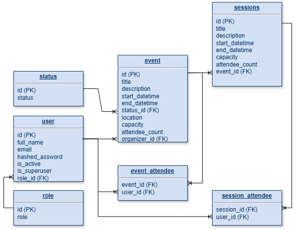

# Mis Eventos - Backend

## Requisitos

* [Docker](https://www.docker.com/).
* [Poetry](https://python-poetry.org) para la gestión de paquetes y dependencias de Python.

## ORM Base de datos SQL



## Docker Compose

Ubicado en el directorio principal, inicie el entorno de desarrollo local con Docker Compose:
```bash
docker compose watch
```

## Flujo general

Las dependencias son administradas con [Poetry](https://python-poetry.org/).

Desde `./backend/` todas las dependencias pueden ser instaladas con:

```console
$ poetry install
```

Luego, se puede iniciar una sesión de shell con el nuevo entorno de Poetry:

```console
$ poetry shell
```

Los modelos SQLModel para los datos se encuentran en `./backend/app/schemas`, las tablas SQL en `./backend/app/models.py`, endpoints de la API en `./backend/app/api/`, utilidades CRUD (Create, Read, Update, Delete) en `./backend/app/crud.py`.

## Test del Backend

Para comprobar el funcionamiento del backend, ejecutar:

```console
$ bash ./scripts/test.sh
```

Las pruebas son ejecutadas con Pytest. Estos se encuentran en `./backend/app/tests/`.

## Migraciones

Para desarrollo local, las migraciones de base datos se ejecutan con comandos `alembic` dentro del contenedor y el código de las migraciones se guaradar en el directorio de la aplicación (en lugar de estar solo dentro del contenedor). 

Para crear una "revisión" de los modelos y d"actualizar" la base de datos con esa revisión:

* Iniciar una sesión interactiva en el contenedor de backend:

```console
$ docker compose exec backend bash
```

* Alembic importa los modelos SQLModel desde `./backend/app/models.py`.

* Luego de modificar un modelo, dentro del contenedor, crear una revisión:

```console
$ alembic revision --autogenerate -m "Add table"
```

* Después de crear la revisión, ejecutar la migración en la base de datos (esto es lo que realmente cambiará la base de datos):

```console
$ alembic upgrade head
```

Para iniciar las migraciones de cero, sin tener ninguna revisión previa, eliminar los archivos de revisión (archivos Python `.py`) en `./backend/app/alembic/versions/`. Y luego crear una primera migración como se describió anteriormente.

## Plantillas de correo electrónico

Las plantillas de correo electrónico se encuentran en `./backend/app/email-templates/`. Aquí, hay dos directorios: `build` y `src`. El directorio `src` contiene los archivos de origen que se utilizan para crear las plantillas de correo electrónico finales. El directorio `build` contiene las plantillas de correo electrónico finales que utiliza la aplicación.
